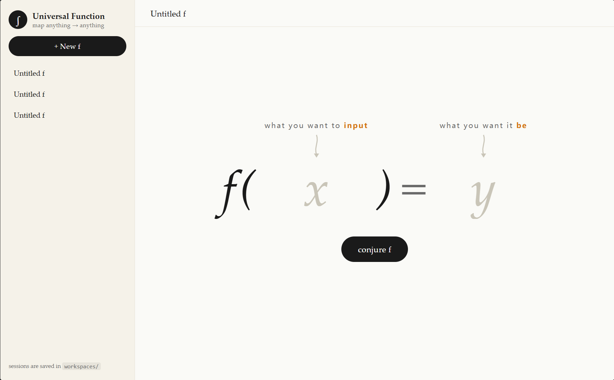
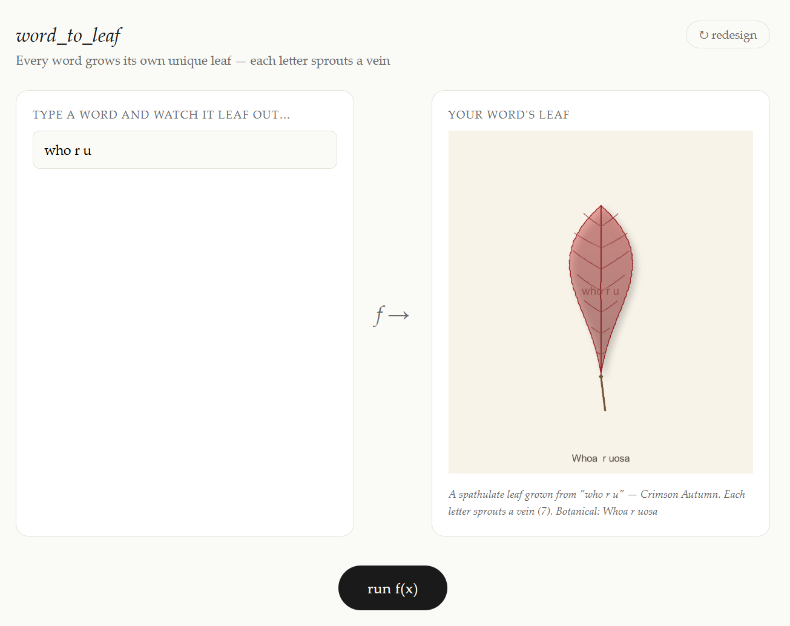
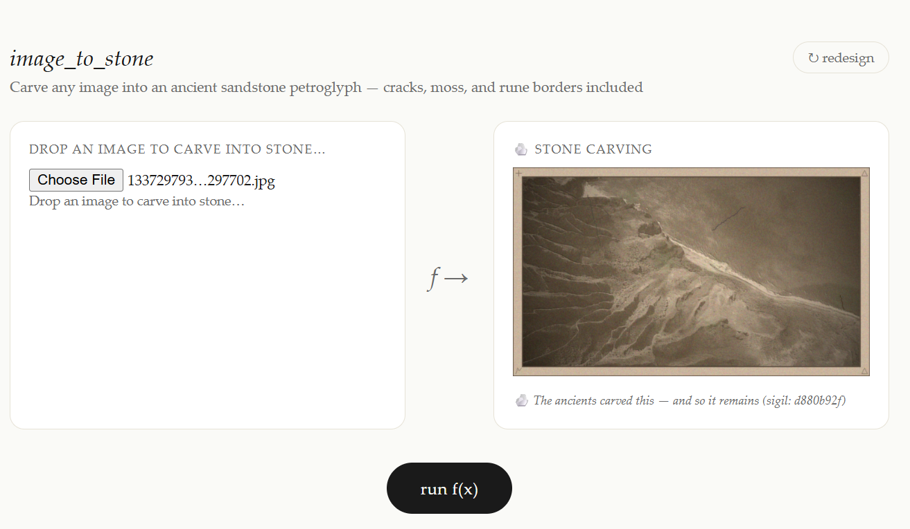
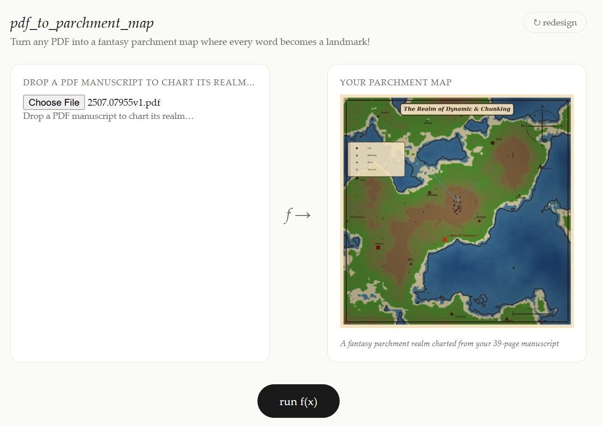
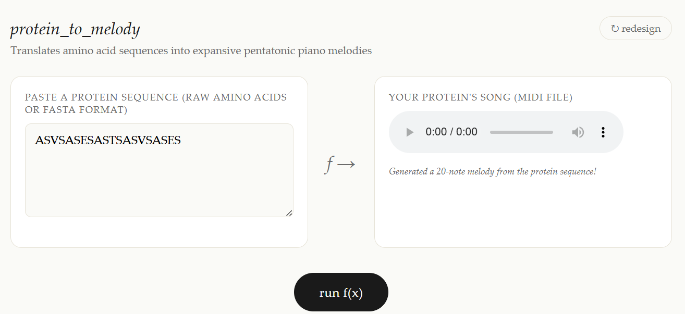

<div align="center">
  
  <h1>Universal Function</h1>
  <p><em>Describe what goes in. Describe what comes out. The AI writes the code.</em></p>
</div>

---

## What is this?

Universal Function is a simple web app you run on your own computer.  
You tell it two things — **what you want to feed in** and **what you want back** — and it uses an AI to write a program that does exactly that, then runs it for you instantly.

No coding required. Works like magic.

| You type… | You get… |
|---|---|
| `x = a word` → `y = a botanical leaf drawing` | An SVG leaf where every letter shapes a vein |
| `x = an image` → `y = an ancient stone carving` | Your photo styled as a sandstone petroglyph |
| `x = a research PDF` → `y = a fantasy treasure map` | Every keyword becomes a landmark on a parchment map |
| `x = a protein sequence` → `y = a melody` | Amino acids turned into a playable MIDI song |

---

## Gallery

<table>
<tr>
<td align="center"><br/><sub>word → botanical leaf</sub></td>
<td align="center"><br/><sub>image → stone carving</sub></td>
</tr>
<tr>
<td align="center"><br/><sub>research PDF → parchment map</sub></td>
<td align="center"><br/><sub>protein → piano melody</sub></td>
</tr>
</table>

---

## Quick Start

> **You need:** Windows, [Python 3.10+](https://www.python.org/downloads/), and an API key from an AI provider.

### Step 1 — Install (one time only)

Double-click **`install.bat`**.  
It will set up everything automatically. Takes about a minute.

> If you don't have Python yet, download it from [python.org](https://www.python.org/downloads/).  
> During installation, **check the box "Add Python to PATH"** — this is important!

### Step 2 — Start the app

Double-click **`start.bat`**.  
Your browser will open automatically at `http://localhost:8000`.

### Step 3 — Add your API key

Click the **⚙ Settings** button at the bottom of the left sidebar and enter your API key.  
Hit **Save settings**. Done — you're ready to conjure functions.

---

## Getting an API Key

You need a key from one of these providers:

| Provider | Sign-up link | Notes |
|---|---|---|
| **OpenAI** | [platform.openai.com](https://platform.openai.com/api-keys) | Works out of the box |
| **Alibaba Dashscope** | [dashscope.aliyuncs.com](https://dashscope.aliyuncs.com) | Set API Base to `https://dashscope.aliyuncs.com/compatible-mode/v1` |
| **Any OpenAI-compatible API** | — | Enter its base URL in the Settings panel |

Paste your key into **⚙ Settings → OpenAI API Key** and save.

---

## Settings Reference

| Setting | What it does | Example |
|---|---|---|
| **API Key** | Your secret key from the AI provider | `sk-abc123…` |
| **API Base URL** | Custom endpoint (leave blank for OpenAI) | `https://dashscope.aliyuncs.com/compatible-mode/v1` |
| **Model** | Which AI model to use | `gpt-4o` or `openai/glm-5.1` |
| **Execution Timeout** | Max seconds a generated function can run | `60` |

---

## How it works (for the curious)

1. You type what **x** is and what **y** should be and click **conjure f**.
2. The AI writes a JSON description *and* Python code for a function `f(x) = y`.
3. Any extra Python libraries the code needs are installed automatically.
4. When you click **run f(x)**, the code runs in a sandboxed subprocess on your computer.
5. The result — text, image, audio, HTML, or a downloadable file — appears on screen.

Each "f" you create is saved in the `workspaces/` folder so you can come back to it later.

---

## ⚠️ Security note

This app **runs AI-generated Python code on your machine**. Only use it with AI providers and inputs you trust. The system prompt instructs the AI to avoid network calls and reading private files, but this is not technically enforced. Do not expose this app to the internet.

---

## Project layout

```
install.bat         ← run this first (Windows)
start.bat           ← run this to launch
requirements.txt    ← Python dependencies
backend/            ← FastAPI server
  main.py           ← API endpoints (sessions, define, run, settings)
  agent.py          ← AI prompt + code extraction
  executor.py       ← subprocess runner with timeout
  sessions.py       ← per-session workspace folders
frontend/           ← browser UI (no build step needed)
  index.html
  style.css
  app.js
workspaces/         ← created automatically, one folder per session
doc/                ← screenshots used in this README
```
